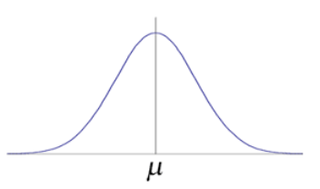

# 중간고사 - perceptron, naive bayes

## Perceptron Learning (퍼셉트론)

perceptron learning은 logistic regression과 외형적으로는 유사하지만 perceptron은 데이터를 두개의 그룹으로 명확하게 나누는 분류 방법이다.

예측에 의미 있는 확률적 해석을 부여하거나 최대 우도 추정 알고리즘으로 도출하는 것은 어렵다.

퍼셉트론에서 만들어지는 y값은 명확하게 두 그룹으로 분류가 가능하다.

- **logistic regression과 perceptron의 공통점**
    
    0과 1로 분류한다는 점에서 비슷하다.
    
- **logistic regression**
    
    연속된 결과를 가지고 그 값에 따라서 그룹을 나누는 형태
    
    - 최대 우도(likelihood) 함수 경향에 대한 가설함수를 통해 데이터 경향에 대한 것을 추정하거나 확률에 대한 예측 → 가설함수가 연속된 형태로 분포한다. → 특정값을 계산하고 그 값에 대한 것이 어디에 위치하는지 분류한다.
- **perceptron**
    - 범위를 두고 정확하게 계산되어지는 값에 따라 그룹이 나뉘지 X
    - x의 형태를 가지고 완전히 나누어지는 상황이 존재한다. 그래프로 표현하면 0과 1의 그룹
    - 연속된 형태의 가설함수 그래프가 존재하지 않는다. ⇒ 특정 지점을 기준으로 0 또는 1로 값이 뚝 떨어지는 계단형태의 그래프를 가진다.

- **Generatice discriminant analysis(생성 판별 분석)**
    
    데이터를 분류하는 하나의 프레임워크를 의미한다.(Generatice learning algorithm)
    
    Discriminates(분류) 
    
    → 우리가 분류를 어떤 식으로 학습해 나가면 되는지 → x가 주어졌을 때 y가 어떤 형태인지
    
    → 조건부 확률 or bayse rule
    
    ⇒p(y}x) 0과 1중에 선택할 수 있다.
    
    → $\Sigma$ = 데이터들의 분포가 평균에서 얼마나 벌어지는지
    
    → $\mu$ = 평균(E[x])
    
    → 공분산 = 두개의 변수 사이에서 얼만큼의 유사도를 가지는지
    
    → z = 데이터 x에 대한 값인 y레이블의 1과 0인 것을 다 합친것 ⇒ 가우시안 분포를 따른다.
    
    - Learn $p(x|y)$ (x: feature(input x),y:class(그룹)
    - Bayes rule : $P(y|x) = \frac{P(x|y)P(y)}{P(x)}$  y=1, y=0일때 모두의 데이터에 대한 확률이다.
        - $P(Y|X)$ 사후 확률 : 우리가 최종적으로 알고 싶은 확률
        - $P(X|Y)$ 우도(likelihood) : 클래스 Y가 주어졌을 때 데이터 x가 나타날 확률
        - $P(Y)$ 사전확률 : 데이터 X와 상관 없이 클래스 Y가 나타날 확률
        - $P(X)$ 증거 : 데이터 X가 나타날 전체 확률
    - 반복적으로 파라미터를 업데이트 하는 복잡한 과정 없이, 데이터의 개수를 세는 카운팅으로 파라미터를 결정할 수 있어 간편하고 연산량이 적다.
        
        ⇒ 조건부 확률과 베이즈 정리를 이용한 분류의 기본 원리
        
- **Gaussian Discriminant Analysis (GDA)**
    - 조건부 확률과 베이즈 정리를 바탕으로 실제로 데이터 분포에 대해서 어떤 식으로 우리가 데이터 그룹들을 만들어낼 수 있는지….
    - $P(x|y)$는 가우시안 분포를 따른다고 가정하고, 조건부 확률과 베이즈 정리를 이용해 데이터를 분류하는 방법
    - 가우시안 분포 : 모든 데이터 샘플들은 임의의 확률 변수를 가지는 형태, 확률값을 가지는 형태라고 가정을 한다. 그 변수가 가우시안 분포를 가지면 볼록한 형태로 데이터가 분포한다.
        
        
        
    
    ⇒ naive bayes를 이해하기 위해 백그라운드 지식으로 실제 계산 과정을 보여준다.
    
    X가 주어졌을 때 y에 대한 확률값을 최대로 하는 y
    
    즉, 주어진 새로운 데이터 X에 대해서 어떤 그룹에 포함될것인지라는 것을 찾는 문제 → 새로운 데이터가 들어왔을 때는 새로운 확률이 나온다.
    
    y=1 class와 y=0 class 중 계산 결과가 더 높은 것이 X에 대한 그룹이다.
    
    ⇒ 주어진 X에 대해서 y에 대한 확률을 계산하여 가장 큰 값인 y를 찾으면 input 데이터 에 대한 y가 1인지 0인지 분류가 가능하다.
    
    **한마디로,  가우시안 분포 형태로 데이터가 존재 할 때(일반적인 형태로) 그 데이터 셋에서 조건부확률과 베이즈이론만 적용된다면 카운팅 값을 가지고 파라미터를 결정할 수 있다.**
    
    **그 후 결정된 파라미터 Y에 대한 분류 예측(0 or 1)이 가능하다.**
    
- **Logistic regression과 GDA**
    - GDA는 모델링 가정이 더 강력하며, 모델링의 가정이 정확할수록 데이터 효율성이 높다.( = 학습을 위해 더 적은 훈련 데이터가 요구됨)
    - logistic resgression의 가정이 더 약하며, 모델링에 대한 가정의 편차에 대해 훨씬더 강건하다.
    - 따라서 logistic regression은 거의 항상 GDA보다 더 나은 성능을 보인다. 그래서 logistic regression이 GDA보다 더 자주 사용된다.

- **Naive Bayes**
    
    Bayes 정리에 기반한 확률적 분류 모델이다 : 과거의 데이터를 통해 앞으로 일어날 사건의 확률을 예측하는 원리
    
    - Feature Vector x : 데이터 포인트를 숫자 갑의 목록으로 표현하는 방법, 각 값은 해당 객체의 구체적인 특성이나 특징을 나타낸다.
    - Bayes 정리 활용 : 특정 데이터 X가 주어졌을 때, 이 데이터가 특정 클래스 Y에 속할 확률⇒P(Y}X)
    - 확률 비교를 통한 분류 : 여러 클래스(Y=1 or Y=0)에 대한 확률을 각각 계산한 후, 더 높은 확률 값을 가진 클래스로 데이터를 분류한다. (ex. Y=1 > Y=0의 확률값 ⇒ 데이터 X를 Y=1로 분류)
        
        $$
        \begin{align*}\underset{y}{\arg\max} P(y|x) &= \underset{y}{\arg\max} \frac{P(x|y)P(y)}{P(x)} \\&= \underset{y}{\arg\max} P(x|y)P(y)\end{align*}
        $$
        
        $$
        \begin{cases}P(x|y=1)P(y=1) \\P(x|y=0)P(y=0)\end{cases}
        $$
        
        → 둘중 더 큰 것인 y가 된다
        

**#이메일 스팸 필터링 문제**

- generatice model 구축 : p(x|y),p(y)
- p(x|y)를 모델링 하기 위해서 다음의 강한 가정을 이용한다 → y에 대해서 조건부 독립
    
    $$
    \begin{align*}p(x_1, \dots, x_{10000}|y) &= p(x_1|y)p(x_2|y,x_1)p(x_3|y,x_1,x_2)\cdots p(x_{10000}|y,x_1,\dots,x_{9999}) \\&= p(x_1|y)p(x_2|y)p(x_3|y)\cdots p(x_{10000}|y) \\&= \prod_{j=1}^{n} p(x_j|y)\end{align*}
    $$
    

→ 각 feaure에 대한 곱으로 표현(n개의 x는 서로 영향을 주지 않아 분리해 계산이 가능하다.)

- **Navie Bayes classifier**
    - Naive Bayes 가정을 기반으로 한 데이터 분류 알고리즘
    - Parameters
        
        $$
        \begin{align*}& \phi_{j|y=1} = p(x_j=1|y=1) \qquad y=1 \text{ 스팸 이메일} \\& \phi_{j|y=0} = p(x_j=1|y=0) \qquad y=0 \text{ 스팸이 아닌 이메일} \\& \phi_{y} = p(y=1)\end{align*}
        $$
        
    - Joint likelihood
    
    $$
    L(\phi_y, \phi_{j|y}) = \prod_{i=1}^{m} p(x^{(i)}, y^{(i)}; \phi_y, \phi_{j|y})
    $$
    
    - Maximum likelihood estimator
        
        $$
        \phi_{j|y=1} = \frac{\sum_{i=1}^{m} 1\{x_{j}^{(i)} = 1 \wedge y^{(i)} = 1\}}{\sum_{i=1}^{m} 1\{y^{(i)} = 1\}}, \\\\ \quad \phi_{j|y=0} = \frac{\sum_{i=1}^{m} 1\{x_{j}^{(i)} = 1 \wedge y^{(i)} = 0\}}{\sum_{i=1}^{m} 1\{y^{(i)} = 0\}}, \quad \phi_{y} = \frac{\sum_{i=1}^{m} 1\{y^{(i)} = 1\}}{m}
        $$
        
        - ^ ⇒ AND
        - 분모 : 내가 원하는 속성만 카운팅한다. ( y=1 일때는 스팸인경우, y=0일때는 스팸이 아닌경우 분류기를 사용하여 예측하먼 y의 값이 1인지 0인지 나온다.)
    - Make prediction(예측)
        
        $$
        \begin{align*}p(y=1|x) &= \frac{p(x|y=1)p(y=1)}{p(x)} \\&= \frac{p(x|y=1)p(y=1)}{p(x|y=1)p(y=1) + p(x|y=0)p(y=0)}\end{align*}
        $$
        
    - ${p(x|y=1)p(y=1) + p(x|y=0)p(y=0)}$ ⇒전체에 대한 확률
    - ex) P(y=1|x) = 0.42 , P(y=0|x)=0.05 라면 y=1이 예측값이 되는것
    - 이 알고리즘은 사전 데이터 확률로 사후 확률을 예측한다. 그래서 내가 가지고 있지 않은 다른 input 데이터가 들어오면 예측이 어렵다. ⇒ 해결위해 ⇒ Laplace Smoothing을 쓴다.

- **Laplace smoothing**
    - 스팸 필터링을 위한 특직 벡터( traning data set)에 나타나지 않은 새로운 단어가 출현한 경우 $p(y=1|x) = \frac{p(x|y=1)p(y=1)}{p(x|y=1)p(y=1) + p(x|y=0)p(y=0)} = \frac{0}{0+0}$ 으로 동작한다.
    - 이러한 문제를 해결하기 위해 1~k의 값을 가지는 확률변수 y의 평균을 추정한다.
        
        $$
        \phi_j = \frac{\sum_{i=1}^{m} 1\{y^{(i)} = j\} + 1}{m + k}, \\\\ \quad \phi_{j|y=1} = \frac{\sum_{i=1}^{m} 1\{x_{j}^{(i)} = 1 \wedge y^{(i)} = 1\} + 1}{\sum_{i=1}^{m} 1\{y^{(i)} = 1\} + k}, \\\\ \quad \phi_{j|y=0} = \frac{\sum_{i=1}^{m} 1\{x_{j}^{(i)} = 1 \wedge y^{(i)} = 0\} + 1}{\sum_{i=1}^{m} 1\{y^{(i)} = 0\} + k}
        $$
        
        - 계산되지 않는 형태를 피하기 위해 분모에 k값을, 분자에 +1을 더해준다.
            
            (k값 : label의 수이다. 현재는 이진분류체계이기 때문에 2개)
            
    - Naive Bayes classifier with Laplace smoothing
        
        $$
        \phi_{j|y=1} = \frac{\sum_{i=1}^{m} 1\{x_{j}^{(i)} = 1 \wedge y^{(i)} = 1\} + 1}{\sum_{i=1}^{m} 1\{y^{(i)} = 1\} + 2}, \\\\ \quad \phi_{j|y=0} = \frac{\sum_{i=1}^{m} 1\{x_{j}^{(i)} = 1 \wedge y^{(i)} = 0\} + 1}{\sum_{i=1}^{m} 1\{y^{(i)} = 0\} + 2}
        $$
        
        [정상과 비정상으로 분류되기 때문에 k=2이다.]